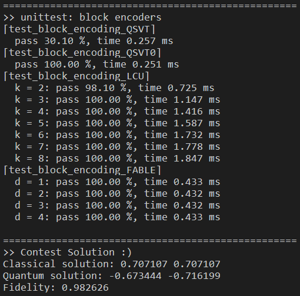

# block_encoding

ℹ 基于 QPanda (C++) 和 PyQPanda (Python) 实现了 4 种块编码算法 Block Encoding 和 5 种量子离散绝热线性系统求解器 Quantum Discrete Adiabetic Linear-system Solver

单元测试运行结果参考：



----

`block_encoding` 模块提供多种**块编码算法**，传入待编码的复矩阵 `MatrixXcd`，返回结构体 `block_encoding_res`，其包含三部分：编码结果酉矩阵 $ U_A $ 、缩放因子 $ \lambda $，和可选的制备线路。不同的编码算法对编码矩阵 `A` 有不同的约束要求，不同的适用场景，不同的时间复杂度和额外开销，详见下表。

> 这里引用 README 的表
> 这里引用 README 的表
> 这里引用 README 的表

```cpp
// 块编码的结果：酉矩阵U_A、缩放因子λ、制备线路(可选)
struct block_encoding_res {
  MatrixXcd unitary;
  float subfactor = 1.0;
  QCircuit circuit;
  block_encoding_res() {}
  block_encoding_res(MatrixXcd unitary, float subfactor=1.0): unitary(unitary), subfactor(subfactor) {}
  block_encoding_res(MatrixXcd unitary, float subfactor, QCircuit circuit): unitary(unitary), subfactor(subfactor), circuit(circuit) {}
};
// 检查块编码是否成功，即 A ~ λ*U_A
bool check_block_encoding(block_encoding_res &res, MatrixXcd &A, float eps=1e-5);
// 起源于 QSVT 领域的直接构造方法 (不可线路制备)
block_encoding_res block_encoding_QSVT(MatrixXcd A);
block_encoding_res block_encoding_QSVT0(MatrixXcd A);
// 基于 LCU 的方法 (可线路制备)
block_encoding_res block_encoding_LCU(MatrixXcd A, float eps=1e-8);
// 基于 FABLE 的方法 (可线路制备)
block_encoding_res block_encoding_FABLE(MatrixXcd A, float eps=1e-8);
```

#### QSVT & QSVT0

#### LCU

#### FABLE

----
by Armit
2024/5/20
