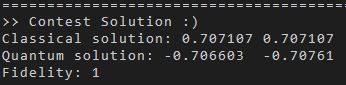
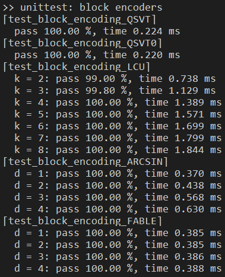
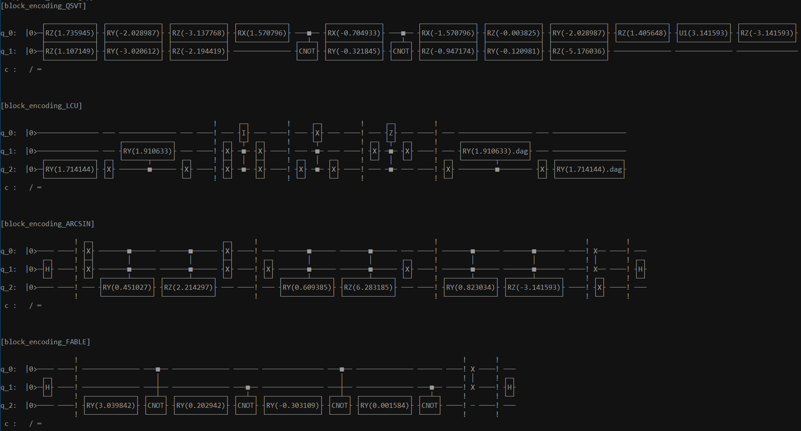

# QLSDA-QPanda

    Quantum Linear Systems Solver via Discrete Adiabatic implemented in QPanda (C++)
    第三届CCF“司南杯”量子计算编程挑战赛-通用赛道 决赛

----

Reproducing the [Quantum Linear Systems Solver via Discrete Adiabatic [arXiv:2111.08152]](https://arxiv.org/abs/2111.08152)

比赛页面: [第三届CCF“司南杯”量子计算编程挑战赛通用赛道](https://learn.originqc.com.cn/zh/contest/list/34/contest:introduction)
队名: 我吃两个  

### Quickstart

- `git clone https://github.com/Kahsolt/QLSDA-QPanda`
  - add `--recursive` if you want QPanda as well
- install the C++ version [QPanda](https://github.com/OriginQ/QPanda-2), building from source... 😈
  - modify `QPANDA_INSTALL_DIR` in [CMakeLists.txt](./CMakeLists.txt) according to your installation
- just run `make` or `bash ./run.sh` 😀🎉

This is the demo run for final linear solver solution:

ℹ Note that there are **two** folders containing source files:

- [/playground](/playground): pennylane tutorials, pure numerical simulations for quick idea verification, debugging scipts
- [/src](/src): the real quantum logical circuit implementation in QPanda (C++) and PyQPanda (python)

### Methods

⚪ block encoding

👉 详细文档参见 [BlockEncoding.md](doc/BlockEncoding.md)  
😈 BlockEncoding 可能是一个非常危险的突破性技术：以后人们只是基于线性代数去设计算法，然后调用 `block_encode + matrix_decompose` 来在量子计算机上运行一切程序  

| Method | restriction | gate implementation | sub-normalizer | ancilla qubits | complex-value support |
| :-: | :-: | :-: | :-: | :-: | :-: |
| [QSVT-like](https://pennylane.ai/qml/demos/tutorial_intro_qsvt/) | $ σ_{max} = \|\|A\|\|_2 \leq 1 $ | use matrix_decompose methods (cannot generally implement with $ \mathcal{O}(poly(n)) $ gates) | - | 1 | ✅ |
| [LCU](https://pennylane.ai/qml/demos/tutorial_lcu_blockencoding/) | $ A = \sum\limits_{k=0}^{N-1} \alpha_k U_k $ | $ U_A = \mathrm{PREP}^\dagger \cdot \mathrm{SEL} \cdot \mathrm{PREP} $ | $ 1 / \sum_k \|\alpha_k\| $ | $ \lceil log_2(k) \rceil $ | ❌ |
| [ARCSIN](https://arxiv.org/abs/2402.17529) | $ d $-sparse $, \|a_{ij}\| \le 1 $ | $ U_A = (I_1 \otimes H^{\otimes n} \otimes I_n) (I_1 \otimes \mathrm{SWAP}) O_A (X \otimes H^{\otimes n} \otimes I_n) $ | $ 1 / 2^n $ | $ n + 1 $ | ✅ |
| [FABLE](https://arxiv.org/abs/2205.00081) | $ d $-sparse $, \|a_{ij}\| \le 1 $ | $ U_A = (I_1 \otimes H^{\otimes n} \otimes I_n) (I_1 \otimes \mathrm{SWAP}) O_A (I_1 \otimes H^{\otimes n} \otimes I_n) $ | $ 1 / 2^n $ | $ n + 1 $ | ❌ |

| Precision Check | Generated Circuit |
| :-: | :-: |
|  |  |

⚪ adiabatic-inspired linear system solver

👉 详细文档参见 [LinearSolver.md](doc/LinearSolver.md)  

| Method | year | sched func $ f(s) $ | time complexity | query complexity (EF paper listed) | query complexity (QDA paper listed) |
| :-: | :-: | :-: | :-: | :-: | :-: |
| [RM (algo-1)](https://arxiv.org/abs/1805.10549) | 2018 | $ \text{v-func} $ | $ \mathcal{O}(\kappa^2 \mathrm{log}(\kappa) / \epsilon) $ | $ \mathcal{O}(\kappa / \epsilon) $ |  |
| [RM (algo-2)](https://arxiv.org/abs/1805.10549) | 2018 | $ \text{v-func} $ | $ \mathcal{O}(\kappa \mathrm{log}(\kappa) / \epsilon) $ | $ \mathcal{O}(\kappa / \epsilon) $ | $ \mathcal{O}(\kappa \mathrm{log}(\kappa) / \epsilon) $ |
| [vanilla AQC](https://arxiv.org/abs/1909.05500) | 2019 | $ \text{linear} $ | $ \mathcal{O}(\kappa^3 / \epsilon) $ | $ \mathcal{O}(\kappa^2 / \epsilon) $ |  |
| [AQC(P)](https://arxiv.org/abs/1909.05500)      | 2019 | $ \text{poly} $ | $ \mathcal{O}(\kappa / \epsilon) \sim \mathcal{O}(\kappa \mathrm{log}(\kappa) / \epsilon) $ | $ \mathcal{O}(\kappa \mathrm{log}(\kappa) \mathrm{loglog}(\kappa)) $ for $ \mathcal{O}(1) $ precision |  |
| [AQC(EXP)](https://arxiv.org/abs/1909.05500)    | 2019 | $ \text{exp} $  | $ \mathcal{O}(\kappa \mathrm{log}^2(\kappa) \mathrm{log}^4(\mathrm{log}(\kappa)/\epsilon)) $ | $ \mathcal{O}(\kappa \mathrm{polylog}(1 / \epsilon)) $ | $ \mathcal{O}(\kappa \mathrm{polylog}(\kappa / \epsilon)) $ |
| [EF](https://arxiv.org/abs/1910.14596) (partial)  | 2019 | $ \text{poly} $ |  | $ \mathcal{O}(\kappa \mathrm{log}(1 / \epsilon)) $ | $ \mathcal{O}(\kappa \mathrm{log}(\kappa / \epsilon)) $ |
| [QDA](https://arxiv.org/abs/2111.08152) (partial) | 2021 | $ \text{poly} $ |  |  | $ \mathcal{O}(\kappa \mathrm{log}(1 / \epsilon)) $ |
| [EQLS](https://arxiv.org/abs/2305.11352) (partial) | 2023 | $ \text{v-func} $ | $ \mathcal{O}(\kappa \mathrm{log}(\kappa / \epsilon)) $ |  |  |

ℹ Note that $ \mathcal{\Omega}(\kappa \mathrm{log}(1 / \epsilon)) $ is the theoretical lower bound for sparse QLSP

> Obviously there is an argument between QDA and EF, that EF overlooked a factor by $ \mathrm{log}(k) $? 🤔
> - EF := AQC(P) + EF = $ \mathcal{O}(\kappa \mathrm{log}(\kappa) \mathrm{loglog}(\kappa)) + \mathcal{O}(\kappa \mathrm{log}(1 / \epsilon)) $
> - QDA := QWalk + EF = $ \mathcal{O}(\kappa) + \mathcal{O}(\kappa \mathrm{log}(1 / \epsilon)) $
> - EQLS: = RM + EF
> OK then, QDA might be right: EF forgot to count for its AQC(p) part

### references

- dev
  - QPanda (C++): [https://github.com/OriginQ/QPanda-2](https://github.com/OriginQ/QPanda-2)
  - Eigen lib: [https://eigen.tuxfamily.org/dox/index.html](https://eigen.tuxfamily.org/dox/index.html)
  - pennylane: [https://github.com/PennyLaneAI/pennylane](https://github.com/PennyLaneAI/pennylane)
- thesis
  - [1] Optimal scaling quantum linear systems solver via discrete adiabatic theorem: [https://arxiv.org/abs/2111.08152](https://arxiv.org/abs/2111.08152)
    - report lecture (2022): [https://www.youtube.com/watch?v=qEA37SfxPEs](https://www.youtube.com/watch?v=qEA37SfxPEs)
  - [3] Quantum algorithm for systems of linear equations with exponentially improved dependence on precision: [https://arxiv.org/abs/1511.02306](https://arxiv.org/abs/1511.02306)
    - report lecture (2015): [https://www.youtube.com/watch?v=IdCCn2X5dW4](https://www.youtube.com/watch?v=IdCCn2X5dW4)
  - [4] Hamiltonian Simulation by Qubitization: [https://arxiv.org/abs/1610.06546](https://arxiv.org/abs/1610.06546)
  - [5] Quantum linear system solver based on time-optimal adiabatic quantum computing and quantum approximate optimization algorithm: [https://arxiv.org/abs/1909.05500](https://arxiv.org/abs/1909.05500)
    - report lecture (2020): [https://www.youtube.com/watch?v=RiRaHGEvlZE](https://www.youtube.com/watch?v=RiRaHGEvlZE)
  - The discrete adiabatic quantum linear system solver has lower constant factors than the randomised adiabatic solver: [https://arxiv.org/abs/2312.07690](https://arxiv.org/abs/2312.07690)
    - report lecture (2024): [https://www.youtube.com/watch?v=WfByvOf3N3Y](https://www.youtube.com/watch?v=WfByvOf3N3Y)
  - Quantum Computation by Adiabatic Evolution: [https://arxiv.org/abs/quant-ph/0001106](https://arxiv.org/abs/quant-ph/0001106)
  - Quantum state preparation by phase randomization: [https://arxiv.org/abs/0903.1652](https://arxiv.org/abs/0903.1652)
  - Quantum algorithms for systems of linear equations inspired by adiabatic quantum computing: [https://arxiv.org/abs/1805.10549](https://arxiv.org/abs/1805.10549)
  - Optimal polynomial based quantum eigenstate filtering with application to solving quantum linear systems: [https://arxiv.org/abs/1910.14596](https://arxiv.org/abs/1910.14596)
  - Efficient quantum linear solver algorithm with detailed running costs: [https://arxiv.org/abs/2305.11352](https://arxiv.org/abs/2305.11352)
- Block Encoding
  - pennylane tutorials
    - Intro to QSVT: [https://pennylane.ai/qml/demos/tutorial_intro_qsvt/](https://pennylane.ai/qml/demos/tutorial_intro_qsvt/)
    - QSVT in Practice: [https://pennylane.ai/qml/demos/tutorial_apply_qsvt/](https://pennylane.ai/qml/demos/tutorial_apply_qsvt/)
    - Linear combination of unitaries and block encodings: [https://pennylane.ai/qml/demos/tutorial_lcu_blockencoding/](https://pennylane.ai/qml/demos/tutorial_lcu_blockencoding/)
    - Block encoding with matrix access oracles: [https://pennylane.ai/qml/demos/tutorial_block_encoding/](https://pennylane.ai/qml/demos/tutorial_block_encoding/)
  - Lecture - The block-encoding: [https://www.ias.edu/sites/default/files/Tang%20qsvt_lect_1.pdf](https://www.ias.edu/sites/default/files/Tang%20qsvt_lect_1.pdf)
  - Hamiltonian simulation with nearly optimal dependence on all parameters: [https://arxiv.org/abs/1501.01715](https://arxiv.org/abs/1501.01715)
  - Explicit Quantum Circuits for Block Encodings of Certain Sparse Matrices: [https://arxiv.org/abs/2203.10236](https://arxiv.org/abs/2203.10236)
  - FABLE: Fast Approximate Quantum Circuits for Block-Encodings: [https://arxiv.org/abs/2205.00081](https://arxiv.org/abs/2205.00081)

----

by Armit
2024/05/13 
