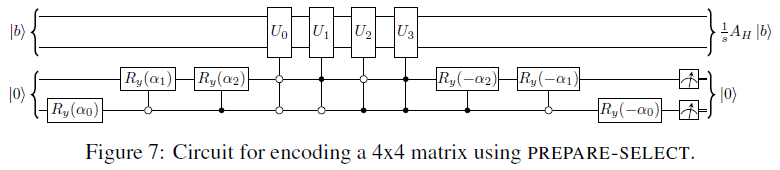
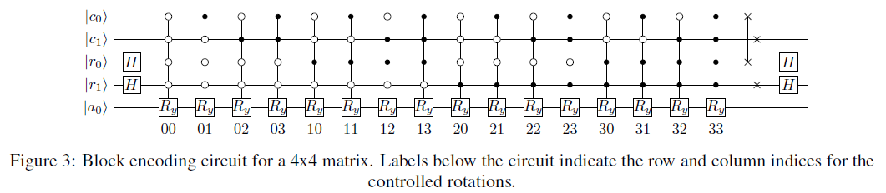
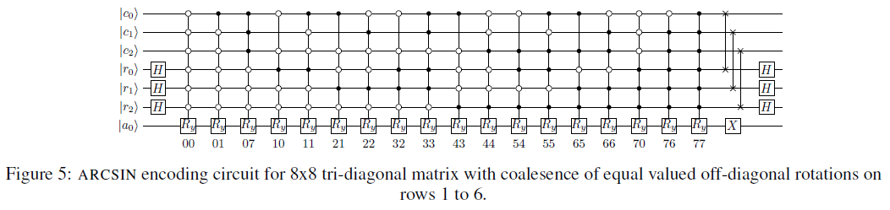
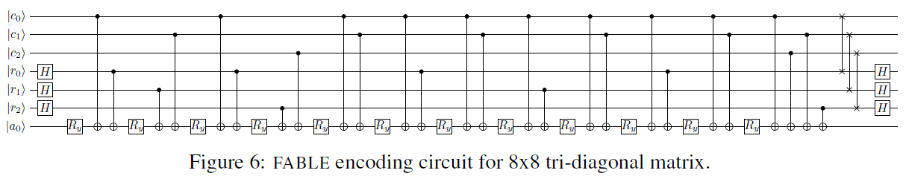

# block_encoding 模块文档

ℹ 我们基于 QPanda (C++) 和 PyQPanda (Python) 实现了 4 种块编码 (Block Encoding) 算法: QSVT-like, LCU, ARCSIN, FABLE 🎉

| method | restriction | gate implementation | sub-normalizer | ancilla qubits | complex-value support |
| :-: | :-: | :-: | :-: | :-: | :-: |
| [QSVT-like](https://pennylane.ai/qml/demos/tutorial_intro_qsvt/) | $ σ_{max} = \|\|A\|\|_2 \leq 1 $ | use matrix_decompose methods (cannot generally implement with $ \mathcal{O}(poly(n)) $ gates) | - | 1 | ✅ |
| [LCU](https://pennylane.ai/qml/demos/tutorial_lcu_blockencoding/) | $ A = \sum\limits_{k=0}^{N-1} \alpha_k U_k $ | $ U_A = \mathrm{PREP}^\dagger \cdot \mathrm{SEL} \cdot \mathrm{PREP} $ | $ 1 / \sum_k \|\alpha_k\| $ | $ \lceil log_2(k) \rceil $ | ❌ |
| [ARCSIN](https://arxiv.org/abs/2402.17529) | $ d $-sparse $, \|a_{ij}\| \le 1 $ | $ U_A = (I_1 \otimes H^{\otimes n} \otimes I_n) (I_1 \otimes \mathrm{SWAP}) O_A (X \otimes H^{\otimes n} \otimes I_n) $ | $ 1 / 2^n $ | $ n + 1 $ | ✅ |
| [FABLE](https://arxiv.org/abs/2205.00081) | $ d $-sparse $, \|a_{ij}\| \le 1 $ | $ U_A = (I_1 \otimes H^{\otimes n} \otimes I_n) (I_1 \otimes \mathrm{SWAP}) O_A (I_1 \otimes H^{\otimes n} \otimes I_n) $ | $ 1 / 2^n $ | $ n + 1 $ | ❌ |

**块编码问题**: 将量子线路的运行纯粹考虑为一个线性代数问题，则计算中有时需要引入一个非酉的矩阵 $ A $。量子门无法直接实现非酉的 $ A $，但可以引入若干辅助比特，编码一个酉矩阵 $ U_A $ 使得 $ A $ 作为其中一个子矩阵块，此时 $ U_A $ 可用量子逻辑门线路实现。即：

$$
\text{For arbitary } A, \text{find a}
\begin{array}{ll}
U_A = \begin{bmatrix}
  A & \star \\
  \star & \star \\
\end{bmatrix}
\end{array}
\text{ that is unitary}.
$$

<div STYLE="page-break-after: always;"></div>

----

### C++ implementation

ℹ [C++实现版本](src/block_encoding.cpp)为通用编码器，用于**正式的比赛提交**

`block_encoding` 模块提供了多种**块编码算法**接口。使用时传入待编码的矩阵 `MatrixXcd`，返回结构体 `block_encoding_res`，其包含三部分：编码结果酉矩阵 $ U_A $ 、缩放因子 $ \lambda $、可选的制备线路（可用于打印查看）。不同的编码算法对编码矩阵 `A` 有不同的约束要求，不同的适用场景，不同的时间复杂度和额外开销。

```cpp
// 块编码的结果：酉矩阵U_A、缩放因子λ、制备线路(可选)
struct block_encoding_res {
  MatrixXcd unitary;
  float subfactor = 1.0;
  QCircuit circuit;
};
// 检查块编码是否成功，即 A ~ U_A/λ
bool check_block_encoding(block_encoding_res &res, MatrixXcd &A, float eps=1e-5);

// (可能)起源于 QSVT 领域的直接构造方法
block_encoding_res block_encoding_QSVT(MatrixXcd A);
block_encoding_res block_encoding_QSVT0(MatrixXcd A);
// 基于 prepare-select 框架的 LCU 的方法
block_encoding_res block_encoding_LCU(MatrixXcd A, float eps=1e-8);
// 基于 query-oracle 框架的 ARCSIN 方法
block_encoding_res block_encoding_ARCSIN(MatrixXcd A, float eps=1e-8);
// 基于 query-oracle 框架的 FABLE 的方法
block_encoding_res block_encoding_FABLE(MatrixXcd A, float eps=1e-8);
```

#### QSVT & QSVT0

ℹ ref: ["Explicit Quantum Circuits for Block Encodings of Certain Sparse Matrices" (arXiv:2203.10236)](https://arxiv.org/abs/2203.10236)

**QSVT方法** 来自于量子奇异值变换(QSVT)领域的直接构造法，对任意形状的复矩阵 $ A $ 满足谱范数 $ ||A||_2 \leq 1 $，构造如下矩阵：

$$
\begin{array}{ll}
U_A = \begin{bmatrix}
  A & \sqrt{I - A A^\dagger} \\
  \sqrt{I - A^\dagger A} & -A^\dagger \\
\end{bmatrix}
\end{array}
$$

其中 $ \sqrt{\cdot} $ 定义为矩阵开根运算，即在 A 的特征分解中对谱系数分别开根 $ \sqrt{A} = V \sqrt{D} V^{-1} $；为了使得副对角线上的子矩阵开根运算有意义，故要求矩阵元素满足 $ coeff\_norm(A) = max \left\{ \mathrm{maxCoeff}(A^\dagger A), \mathrm{maxCoeff}(A A^\dagger) \right\} \leq 1 $，此即等价于对矩阵 $ A $ 的唯一约束条件 $ ||A||_2 \leq 1 $ 。

易验证此 $ U_A $ 即为满足 $ U_A^\dagger U_A = I$ 性质的酉矩阵，且 $ A $ 出现在 $ U_A $ 左上角的子空间，故 $ U_A $ 为 $ A $ 的一个块编码：缩放因子 $ \lambda = 1 $，误差 $ \epsilon = 0 $，需要 $ 1 $ 个额外的辅助比特用于矩阵长宽扩张。

ℹ 当 $ A $ 不满足条件 $ ||A||_2 \leq 1 $ 时，可考虑作规范化 $ \tilde{A} = A / coeff\_norm(A) $，转而对 $ \tilde{A} $ 进行块编码。

**QSVT0方法** 是 QSVT 方法的一个特例，针对 $ A $ 为 $ 2 \times 2 $ 的实系数对称矩阵：

$$
\begin{array}{ll}
A = \begin{bmatrix}
  \alpha_1 & \alpha_2 \\
  \alpha_2 & \alpha_1 \\
\end{bmatrix}
\end{array}
$$

构造下列矩阵：

$$
\begin{array}{ll}
U_\alpha = \begin{bmatrix}
  \alpha_1 & \alpha_2 & \alpha_1 & -\alpha_2 \\
  \alpha_2 & \alpha_1 & -\alpha_2 & \alpha_1 \\
  \alpha_1 & -\alpha_2 & \alpha_1 & \alpha_2 \\
  -\alpha_2 & \alpha_1 & \alpha_2 & \alpha_1 \\
\end{bmatrix}
U_\beta = \begin{bmatrix}
  \beta_1 & \beta_2 & \beta_1 & -\beta_2 \\
  \beta_2 & \beta_1 & -\beta_2 & \beta_1 \\
  \beta_1 & -\beta_2 & \beta_1 & \beta_2 \\
  -\beta_2 & \beta_1 & \beta_2 & \beta_1 \\
\end{bmatrix}
U_A = \frac{1}{2} \begin{bmatrix}
  U_\alpha & -U_\beta \\
  U_\beta & U_\alpha \\
\end{bmatrix}
\end{array}
$$

其中 $ \beta_k = \sqrt{1 - \alpha_k^2} $，$ k \in \{1, 2\} $。  

则易验证此 $ U_A $ 为酉矩阵，且 $ \frac{1}{2} A $ 出现在 $ U_A $ 左上角的子空间，故 $ U_A $ 为 $ A $ 的一个块编码：缩放因子 $ \lambda = \frac{1}{2} $，误差 $ \epsilon = 0 $，需要 $ 2 $ 个额外的辅助比特用于矩阵长宽扩张。

⚠ 需要注意的是，基于 QSVT 的方法没有一般高效可行的多项式级复杂度 $ \mathcal{O}(\mathrm{poly}(n)) $ 量子逻辑门线路构造方案，但仍然可以通过各种矩阵分解的方法得到指数级复杂度的逻辑门线路实现，例如可通过 QPanda 中的 `matrix_decompose_qr()` 或 `unitary_decomposer_nq` 接口进行 QR/CSD/QSD 分解得到对应的量子线路。

#### LCU

ℹ ref: ["Hamiltonian Simulation Using Linear Combinations of Unitary Operations" (arXiv:1202.5822)](https://arxiv.org/pdf/1202.5822)

**LCU方法** 适用于待编码矩阵 $ A $ 可以分解为若干个酉矩阵的线性加和的情况，特别地，一个哈密顿量矩阵通常能被分解为一系列基本 Pauli 矩阵的线性加和，即有：

$$ A = \sum\limits_{i=0}^{M-1} \alpha_i U_i $$

可通过 PREPARE-SELECT 结构的线路对矩阵 $ A $ 进行块编码制备：


从纵向看该线路，上方的 $ \left| b \right> $ 为 $ \mathrm{log}_2(N) $ 个工作比特，其中 $ N $ 为方阵的维数；下方的 $ \left| 0 \right> $ 为 $ \lceil \mathrm{log}_2(M) \rceil $ 个辅助比特，其中 $ M $ 为分解出来的酉矩阵的项数。从横向看该线路，可拆分为三段：PREP、SELECT 和 PREP$^\dagger$，PREP 部分是一个振幅编码(Amplitude Encoding)线路，用于编码线性和的系数向量 $ \{\alpha_i\} $，SELECT 部分是一组多比特控制酉门阵列。完整的线路结构可以读作：通过振幅编码来提供每项对应的系数 $ \alpha_i $，通过控制比特的位序和门控条件来选择每项对应的酉矩阵 $ U_i $，从而组合出原矩阵 $ A $ 的线性分解形式。

PREP 和 SELETCT 部分的效果可用公式表达为：

$$
\mathrm{PREP} \left| 0 \right> = \sum\limits_{i=0}^{M-1} \sqrt \frac{\alpha_i}{s} \left| i \right> \\
\mathrm{SELECT} = \sum\limits_{i=0}^{M-1} \left| i \right> \left< i \right| \otimes U_i
$$

其中 $ s = \sum_M |\alpha_i| $，故完整线路为：

$$
\mathrm{PREP^\dagger} \cdot \mathrm{SELECT} \cdot \mathrm{PREP} = \sum\limits_{i=0}^{M-1} \frac{\alpha_i}{s} U_i = \frac{1}{s} A
$$

具体代码实现时有以下要点：

- 比特位序需要以辅助比特在低位，以保证待编码的矩阵 $ A $ (乘以缩放因子 $ \lambda $ 后) 最终整体出现在完整线路所对应酉矩阵的左上角，而非分散在其间
- 对系数列 $ \{\alpha_i\} $ 进行振幅编码时，需要对系数列进行归一化，最终编码的实际振幅为 $ a_i = \sqrt \frac{\alpha_i}{s} $，因而最终编码的矩阵也实际为 $ \frac{1}{s} A $
- 对于矩阵 $ A $ 的酉和分解可以通过 QPanda 中的接口 `matrix_decompose_hamiltonian()` 或 `matrix_decompose_paulis()` 得到；原理上 LCU 方法是支持复矩阵的，但 QPanda 的接口暂时不支持复数，因而我们的实现也暂时只支持实矩阵 :(
- 在多比特控制酉门中，使用 X 门以实现控制条件中的“非”
- 可以舍去系数绝对值 $ |\alpha_{i}| $ 比较小的项

最终容易验证此线路实现了对于 $ A $ 的一个块编码：缩放因子 $ \lambda = \frac{1}{s} $，误差 $ \epsilon $ 取决于舍去项的系数阈值，需要 $ \lceil \mathrm{log}_2(M) \rceil $ 个额外的辅助比特用于编码线性分解的系数列 $ \{\alpha_i\} $ 和实现多比特控制酉门的二进制下标索引。

#### ARCSIN

ℹ ref: ["Evaluation of block encoding for sparse matrix inversion using QSVT" (arXiv:2402.17529)](https://arxiv.org/abs/2402.17529)

**ARCSIN方法** 是基于 query-oracle 框架的基本块编码方案 ARCCOS 的小改进，适用于稀疏矩阵，而减少了所需门的数量。先考虑基本的 ARCCOS 方案线路：



从纵向看该线路，顺次为 1 个辅助比特 $ \left| a_0 \right> $， $ N $ 个行索引比特 $ \left| r_i \right> $， $ N $ 个列索引比特 $ \left| c_j \right> $，其中 $ N $ 为待编码矩阵 $ A $ 的维数。从横向看该线路，可拆分为四段：H、$ O_{A} $、SWAP 和 H，其中 $ O_{A} $ 即为中间的多比特控制 RY 门阵列，相当于 PREPARE-SELECT 结构中的 SELECT 组件。

考虑线路中各组件的效果：

$$
\mathrm{H} \left | 0 \right> = \frac{1}{\sqrt s} \sum\limits_{k=0}^{s-1} \left | k \right> \\
O_{A} \left| 0 \right> \left| i,j \right> = \left( a_{i,j} \left| 0 \right> + \sqrt {1 - |a_{i,j}|^2} \left| 1 \right> \right) \left| i,j \right> \\
\mathrm{SWAP} \left | r \right> \left | c \right> = \left | c \right> \left | r \right>
$$

其中 $ s = 2^N $。经过复杂的运算可以理解完整线路的作用是，把行/列索引寄存器所对应指示的矩阵单元格的值 $ a_{i,j} $ (乘以缩放因子 $ \lambda $ 后) 写入辅助比特的振幅中，亦即：

$$
U_A = \mathrm{H} \cdot \mathrm{SWAP} \cdot O_{A} \cdot \mathrm{H} \\
U_A \left| 0 \right> \left| r,c \right> = \left( \frac{a_{i,j}}{s} \left| 0 \right> + \sqrt {1 - |\frac{a_{i,j}}{s}|^2} \left| 1 \right> \right) \left| r,c \right> \\
$$

进一步考虑实数矩阵 $ A $ 在编码矩阵的每个单元 $ a_{i,j} $ 时，线路 $ O_{A} $ 中就会多一个对应的多比特控制 RY 门，其旋转角度为 $ \theta = 2 arccos(a_{i,j}) $；则当 $ A $ 为稀疏矩阵时，就会有很多个 $ RY $ 门的旋转角度为 $ \theta = 2 arccos(0) = \pi / 2 $。故 ARCSIN 方案尝试改进这一点，仍然使用 $ RY $ 门，但设置旋转角度为 $ \theta = 2 arcsin(a_{i,j}) $，并在线路末尾追加一个 X 门来反转这个影响，从而省去了对零元素进行编码，改进后的线路如下图所示：



主要的差异在于 $ O_{A} $ 部分交换了计算基分解的系数：

$$
O_{A} \left| 0 \right> \left| i,j \right> = \left( \sqrt {1 - |a_{i,j}|^2} \left| 0 \right> + a_{i,j} \left| 1 \right> \right) \left| i,j \right>
$$

故需要在线路末尾补一个 X 门来再次交换该系数，进而等效于 ARCCOS 方案。

具体代码实现时有以下要点：

- 比特位序需要以辅助比特在低位，以保证待编码的矩阵 $ A $ (乘以缩放因子 $ \lambda $ 后) 最终整体出现在完整线路所对应酉矩阵的左上角，而非分散在其间
- 行/列索引寄存器的顺序编号和主比特序是相反的 😈
- 对于复矩阵 $ A $ 而言，只需要同比增加 RZ 门来编码对应的相角
- 在多比特控制酉门中，使用 X 门以实现控制条件中的“非”
- 可以舍去系数绝对值 $ |a_{i,j}| $ 比较小的单元格

最终容易验证此线路实现了对于 $ A $ 的一个块编码：缩放因子 $ \lambda = \frac{1}{s} $，误差 $ \epsilon $ 取决于舍去单元格的系数阈值，需要 $ N + 1 $ 个额外的辅助比特用于矩阵下标索引和矩阵单元格值的读出。

#### FABLE

ℹ ref: ["FABLE: Fast Approximate Quantum Circuits for Block-Encodings" (arXiv:2205.00081)](https://arxiv.org/abs/2205.00081)

**FABLE** 是一种基于 query-oracle 框架的高效块编码方案，适用于稀疏矩阵，通过逻辑门对消和格雷码编码技术极大压缩了线路深度，且不需要多比特控制门就能实现。



线路方案描述较为复杂，读者可以自行参考论文来理解。一个 FABLE 线路样例如上图所示，可见其主要思路还是基于 ARCCOS 方案进行优化：1.对易的多比特控制门进行对消，2. 连续的旋转门进行角度合并。

对于该方案，我们的代码实现直接迁移了 [pennylane 库中的实现](https://github.com/PennyLaneAI/pennylane/blob/master/pennylane/templates/subroutines/fable.py)，暂时也不支持复矩阵的编码。块编码的相关参数如缩放因子、误差、辅助比特数等都和 ARCSIN 方法一致。

#### 附录

基准单元测试运行结果参考 (`T=1000, eps=1e-5`)：


<div STYLE="page-break-after: always;"></div>

----

### Python implementation

ℹ [Python实现版本](../src/block_encoding.py)含具体矩阵编码样例，用于**快速理解、开发、测试**

生成线路样例参考：


----
by Armit
2024/5/20
